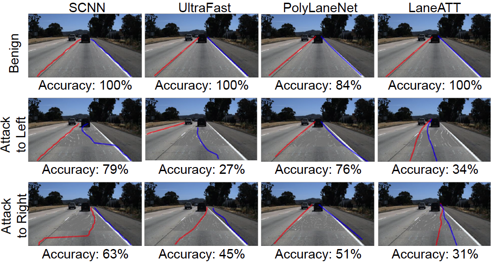
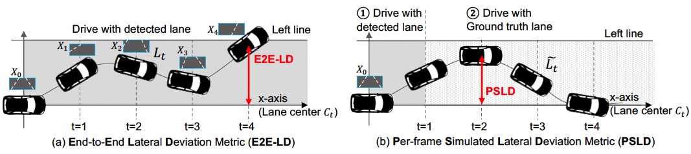
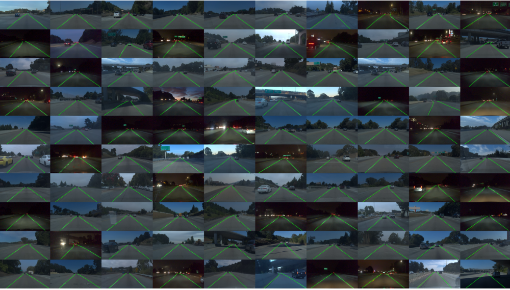
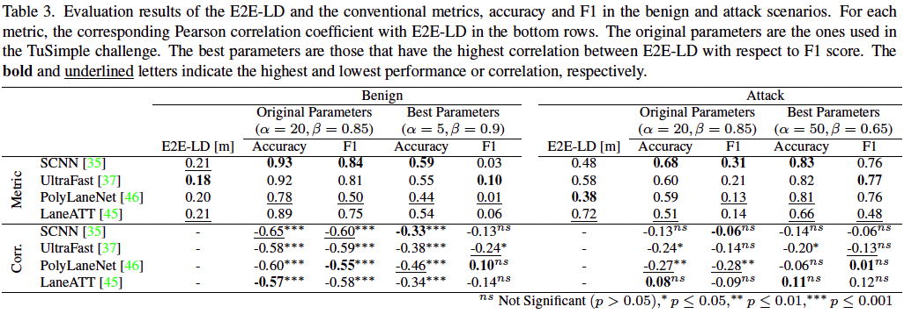
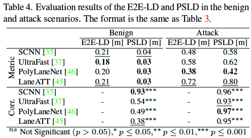

# Towards Driving-Oriented Metric for Lane Detection Models

This repository holds the source code for "Towards Driving-Oriented Metric for Lane Detection Models" (CVPR 2022), by Takami Sato and Qi Alfred Chen. 

## Motivation



The above figure shows examples of lane detection results and the accuracy metric in benign and adversarial attack scenarios on the TuSimple Challenge dataset. As shown, the conventional accuracy metric does not necessarily indicate drivability if used in autonomous driving, the core downsteam task. For example, SCNN always has higher accuracy than PolyLaneNet, but its detection results are making it much harder to achieve lane centering. To evaluate the validity of the metrics, we conduct a large-scale empirical study with 4 major types of lane detection approaches on the TuSimple dataset and our newly constructed dataset Comma2k19-LD.

## New metric: E2E-LD and PSLD



To more effectively measure the performance of lane detection models when used for autonomous driving, we design 2 new driving-oriented metrics for lane detection: End-to-End Lateral Deviation metric (E2E-LD) is directly formulated based on the requirements of autonomous driving, a core downstream task of lane detection; Per-frame Simulated Lateral Deviation metric (PSLD) is a lightweight surrogate metric of E2E-LD.

## New dataset: Comma2k19 LD



Link: https://www.kaggle.com/tkm2261/comma2k19-ld/code

To evaluate both the conventional metrics and the downstream task-centric metrics E2E-LD and PSLD on the same dataset, we need both lane line annotations and driving information (e.g., position, steering angle, and velocity). Unfortunately, there is no existing dataset that satisfies the requirements to our best knowledge. Thus, we create a new dataset, coined Comma2k19-LD, based on [Comma2k19 dataset](https://github.com/commaai/comma2k19).

## Results



Our results show that the conventional metrics have strongly negative correlations (<= -0.55) with E2E-LD, meaning that some recent improvements purely targeting the conventional metrics may not have led to meaningful improvements in autonomous driving, but rather may actually have made it worse by overfitting to the conventional metrics.



On the contrary, PSLD shows statistically significant strong positive correlations (>= 0.38) with E2E-LD. As a result, the conventional metrics tend to overestimate less robust models. We hope that our study will help the community achieve more downstream task-aware evaluations for lane detection.

# Reproduction

## Environment setup with docker

1. Clone this repository.
1. Download the following datasets to the root of the repository
    * [Comma2k19 LD](https://www.kaggle.com/tkm2261/comma2k19-ld) into `comma2k19-ld/`
        * Plase also see https://www.kaggle.com/tkm2261/usage-of-comma2k19-ld
    * [tusimple-test](https://www.kaggle.com/tkm2261/tusimple-test) into `tusimple-test/`
    * [pretrained LD models](https://www.kaggle.com/tkm2261/ld-pretrained-models) into `pretrained_models/`
1. Build and run the docker image as follow.

```bash
cd ld-metric/
docker build -t ld-metric -f Dockerfile ./

docker run -v $PWD:/working -w /working --gpus all --shm-size=8gb --rm -it ld-metric /bin/bash
```

*Note: LaneATT only works with PyTorch=1.6. In other versions, performance degradation happens.*

4. Compile LaneATT

```bash
cd LaneATT/lib/nms; python setup.py install; cd - # run in docker container
```

## Evaluation on TuSimple Dataset

### Experiments

```bash
bash scripts/replay_tusimple_benign.sh # Benign
bash scripts/run_tusimple_drp_wb.sh # Attack
```

### Evaluation

* `notebooks/TuSimple_results_old_metric.ipynb`


## Evaluation on Comam2k19 LD Dataset

### Experiments

Please run following commands.

```bash
bash scripts/replay_comma_more_noupdate.sh # Benign F1 and accuracy
bash scripts/replay_comma_more.sh # Benign E2E-LD
bash scripts/replay_comma_more_metric.sh # Benign PSLD
bash scripts/run_comma_more_attack_drp_wb.sh # Attack patch generation and E2E-LD
bash scripts/replay_comma_more_attack_drp_wb.sh # Attacked E2E-LD
bash scripts/replay_comma_more_attack_drp_wb_metric.sh # Attacked PSLD
```

### Evaluation

Please see the following notebooks.

* `notebooks/Comma2k19LD_benign_new_metric.ipynb`
* `notebooks/Comma2k19LD_benign_old_metric.ipynb`
* `notebooks/Comma2k19LD_attack_new_metric.ipynb`
* `notebooks/Comma2k19LD_attack_old_metric.ipynb`


# Citation
If you use our code in your research, please cite:

```bibtex
@InProceedings{sato2022towards,
  author    = {Takami Sato and Qi Alfred Chen},
  title     = {{Towards Driving-Oriented Metric for Lane Detection Models}},
  booktitle = {Conference on Computer Vision and Pattern Recognition (CVPR)},
  year      = {2022}
}
